# HR Metrics Monitoring and Attrition Analysis

**A guided project from DataCamp´s career track: [Data Analyst in Power BI](https://app.datacamp.com/learn/career-tracks/data-analyst-in-power-bi)**

Image from [Freepik](https://www.freepik.com/search?format=search&last_filter=query&last_value=HR&query=HR)

---
## Table Of Contents

- [Executive Summary](#executive-summary)
  - [Primary Goal](#primary-goal)
  - [Key Findings](#key-findings)
  - [Recommendations](#recommendations)
- [Introduction](#introduction)
  - [Business Problem](#business-problem)
  - [Goals](#goals)
- [Methodology](#methodology)
  - [Data Source](#data-source)
  - [Tools and Techniques](#tools-and-techniques)
  - [Data Understanding](#data-understanding)
  - [Data Cleaning](#data-cleaning)
  - [Data Transformation](#data-transformation)
  - [DAX measures](#dax-measures)
  - [Data Analysis](#data-analysis)
  - [Data Visualisation](#data-visualisation)
- [Results and Implications](#results-and-implications)
  - [Demographics](#demographics)
  - [Attrition](#attrition)
  - [Performance](#performance)
  - [Implications](#implications)
- [Power BI File](#power-bi-file)

---
## Executive Summary
### Primary Goal
Analyse Human Resources (HR) metrics and employee performance to identify attrition drivers.

### Key Findings
- __Demographics:__ The majority of employees are between 20 and 29 years old, with a slightly higher proportion of women than men (2.7%).
- __Attrition:__ The overall attrition rate is 16.1%, with Sales Representative roles experiencing the highest turnover.
- __Performance:__ Managerial rating levels and self-performance levels do not always align.

### Recommendations

- __Targeted retention programmes:__ Implement specific retention initiatives for departments with high turnover, such as Sales.
- __Employee Satisfaction Initiatives:__ Enhance employee satisfaction through recognition programmes, flexible work arrangements, and improved communication.
- __Managerial Development:__ Provide training and support to managers to improve their leadership skills and create a positive work environment.
- __Compensation and Benefits Review:__ Regularly review compensation and benefits packages to ensure they remain competitive.

Conclusion: By implementing these recommendations, Atlas Labs can significantly reduce employee turnover, improve morale, and enhance overall organisational performance.

---

## Introduction

### Business Problem
Atlas Labs is facing a significant challenge with employee turnover, which is negatively impacting productivity, morale, and the bottom line. Understanding the underlying causes of attrition is crucial for developing effective retention strategies.

### Goals
1. Identify the primary factors contributing to employee turnover.
2. Develop targeted retention strategies to address these factors.
3. Improve overall employee satisfaction and engagement.

---
## Methodology

### Data Source
The analysis is based on HR data from Atlas Labs, covering demographics, tenure, salary, performance reviews, and attrition information for 1470 employees. Datasets were obtained through [DataCamp](https://www.datacamp.com/users/sign_in?redirect=http%3A%2F%2Fapp.datacamp.com%2Flearn)

### Tools and Techniques
Power BI, DAX functions, Data Modelling, and Exploratory Data Analysis (EDA).

### Data Understanding
tlas Labs is a fictitious software company. To perform the analysis, I used HR records that consisted of five tables: `EducationLevel`, `Employee`, `RatingLevel`, `SatisfiedLevel`, and `PerformanceRating`. For more details on each dataset, please review the [Metadata](assets/datasets/metadata.md) page.

### Data Cleaning
I initiated a new Power BI report and imported the five CSV datasets. To clarify the table roles, I prepended 'Fact' or 'Dim' to each table name, designating them as either fact or dimension tables. I then ensured that the columns were correctly formatted according to the [Metadata](assets/datasets/metadata.md) information. 

### Data Transformation and Modelling
I created a new calculated date table using the DAX code from the [DimDate.txt](assets/datasets/DimDate.txt) file.

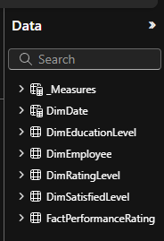

 Once the data was loaded and cleaned, I generated a data model to establish the relatioships between tables. This image shows the initial data model.

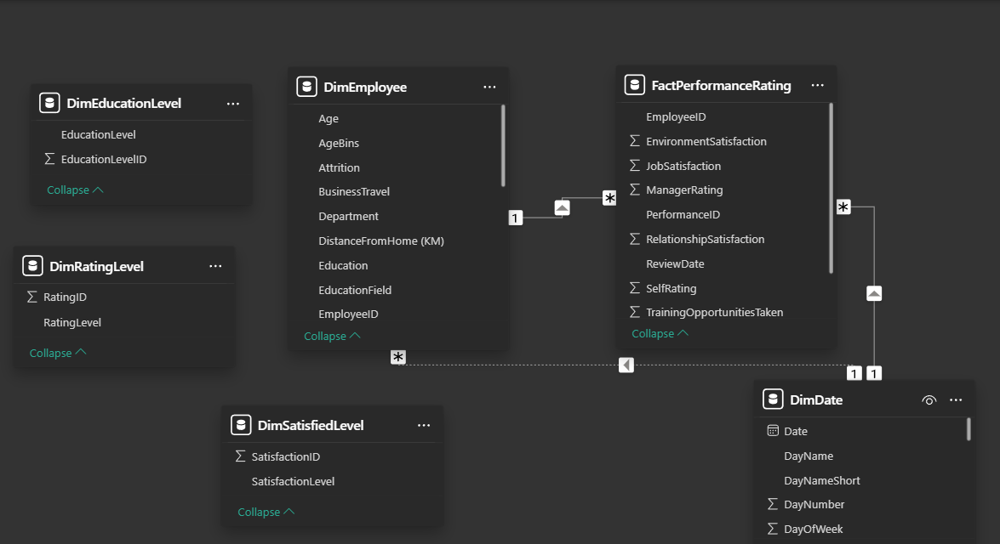

 Final data model: The image below illustrates the final data model used for the analysis.

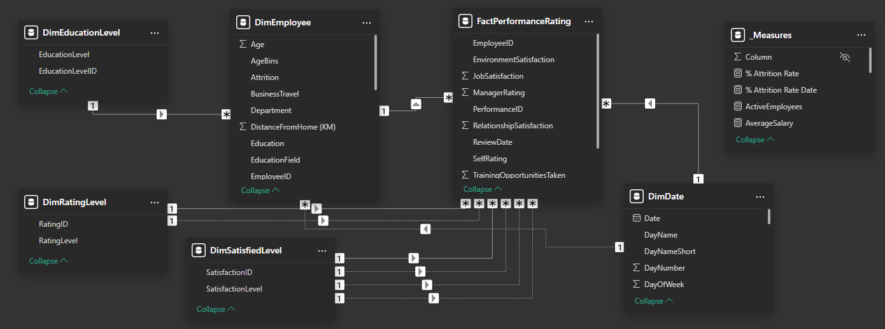

### DAX measures
Measures Table: I created a table containing all the necessary measures for the analysis, utilising DAX formulas to generate these measures.

| Measure | Description | DAX code |
| :--- | --- | :--- |
| `TotalEmployees` | Calculates the overall number of employees currently working at the company | `TotalEmployees = DISTINCTCOUNT(DimEmployee[EmployeeID])` |
| `ActiveEmployees` | Shows the count of employees who are currently employed and active in the company | `ActiveEmployees = CALCULATE(COUNT(DimEmployee[EmployeeID]), FILTER(DimEmployee, DimEmployee[Attrition] = "No"))` |
| `InactiveEmployees` | Counts the number of employees who have left the company | `InactiveEmployees = CALCULATE(COUNT(DimEmployee[EmployeeID]), FILTER(DimEmployee, DimEmployee[Attrition] = "Yes"))` |
| `% Attrition Rate` | Calculates the percentage of employees who have left the company relative to the total number of employees | `% Attrition Rate = DIVIDE([InactiveEmployees], [TotalEmployees])` |
| `TotalEmployeesDate` | Displays the total count of employees on specific dates | `TotalEmployeesDate = CALCULATE([TotalEmployees], USERELATIONSHIP(DimDate[Date], DimEmployee[HireDate]))` |
| `AverageSalary` | Provides the average salary of all employees in the company | `AverageSalary = AVERAGE(DimEmployee[Salary])` |
| `FullName` | Combines first names and last names to get the full name of each employee | `CONCATENATE(DimEmployee[FirstName], CONCATENATE(" ", DimEmployee[LastName]))` |
| `LastReviewDate` | Displays the date of the most recent performance review for a selected employee | `LastReviewDate = IF ( MAX ( FactPerformanceRating[ReviewDate] ) = BLANK(), "No Review Yet", MAX ( FactPerformanceRating[ReviewDate] ))` |
| `NextReviewDate` | Calculates the date for the next performance review, which should be 365 days after the `LastReviewDate` | `NextReviewDate = VAR review = IF ( MAX ( FactPerformanceRating[ReviewDate] ) = BLANK (), MAX ( DimEmployee[HireDate] ),  MAX ( FactPerformanceRating[ReviewDate] )) RETURN review + 365` |
| `JobSatisfaction` | Shows the highest level of satisfaction employees have with their job roles | `JobSatisfaction = MAX(FactPerformanceRating[JobSatisfaction])` |
| `EnvironmentSatisfaction` | Shows the highest rating of employees’ satisfaction with their work environment | `EnvironmentSatisfaction = CALCULATE ( MAX ( FactPerformanceRating[EnvironmentSatisfaction] ), USERELATIONSHIP ( FactPerformanceRating[EnvironmentSatisfaction], DimSatisfiedLevel[SatisfactionID] ) )` |
| `RelationshipSatisfaction` | Estimates the highest level of satisfaction employees have with their relationships at work | `RelationshipSatisfaction = CALCULATE ( MAX (FactPerformanceRating[RelationshipSatisfaction] ), USERELATIONSHIP ( FactPerformanceRating[RelationshipSatisfaction] , DimSatisfiedLevel[SatisfactionID] ) )` |
| `WorkLifeBalance` | Measures the highest level of satisfaction employees have with their work-life balance | `WorkLifeBalance = CALCULATE ( MAX (FactPerformanceRating[WorkLifeBalance]), USERELATIONSHIP ( FactPerformanceRating[WorkLifeBalance], DimSatisfiedLevel[SatisfactionID] ) ` |
| `Self_Rating` | Calculates the highest rating of employee performance based on their own self-assessment | `Self_Rating = CALCULATE ( MAX (FactPerformanceRating[SelfRating] ), USERELATIONSHIP ( FactPerformanceRating[SelfRating] , DimRatingLevel[RatingID] ))` |
| `Manager_Rating` | Calculates the highest rating of employee performance based on their manager’s assessment | `Manager_Rating = CALCULATE ( MAX (FactPerformanceRating[ManagerRating]), USERELATIONSHIP ( FactPerformanceRating[ManagerRating] , DimRatingLevel[RatingID] ))` |
| `Inactive_Employees_Date` | Quantifies the number of inactive employees on specific dates | `Inactive_Employees_Date = CALCULATE( [InactiveEmployees], USERELATIONSHIP ( DimDate[Date], DimEmployee[HireDate] ))` |
| `% Attrition Rate Date` | Calculates the attrition rates based on the number of inactive employees on specific dates | `% Attrition Rate Date = DIVIDE([Inactive_Employees_Date], [TotalEmployeesDate])` |

### Data Analysis
- Exploratory Data Analysis (EDA): I used descriptive statistics and data visualisation to identify trends and patterns in the data.
- Key Metrics: Analysed employee satisfaction, turnover rates, diversity indexes, and hiring trends.

### Data Visualisation
I created a report in Power BI to showcase the results of the analysis.

_Overview_ provides a high-level summary of key metrics related to attrition at the company, including:
- Total Employees: The overall number of employees (1470).
- Active and Inactive Employees: Breakdown of currently active (1233) and inactive employees (237).
- Employees by Department and Role: Distribution of active employees across different departments (Technology, Sales, and HR) and roles.
- Attrition Rate: The percentage of employees leaving the company over a specific period (16.1%).
- Hiring Trend by Year: The trend of employee hiring over the past years (2012 to 2022).
  
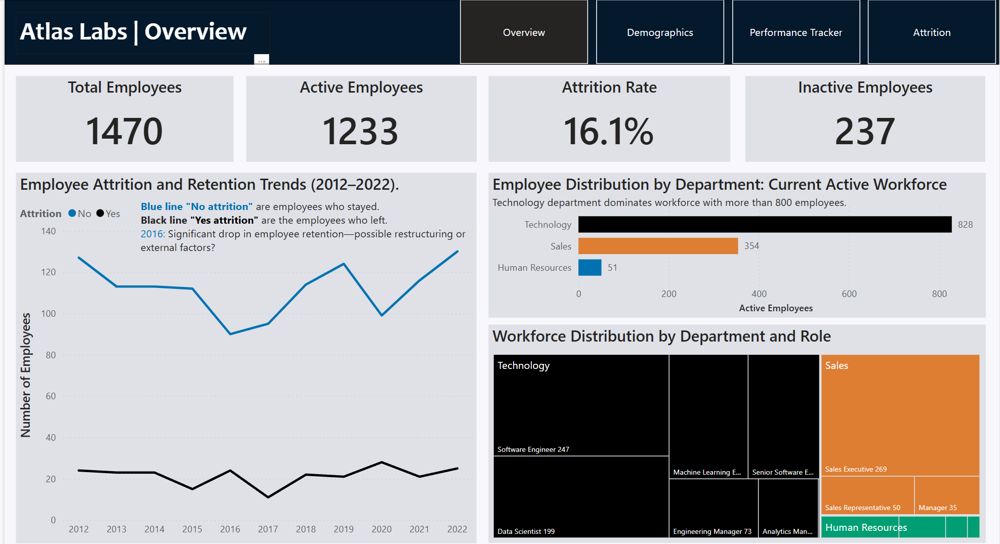

The interactive elements of the Overview page in my Power BI report allow users to explore various metrics and trends related to employee attrition, such as: viewing the total number of employees and their status (active/inactive), exploring the distribution of employees by department and role, and analysing the attrition rate and observing hiring trends over the years.

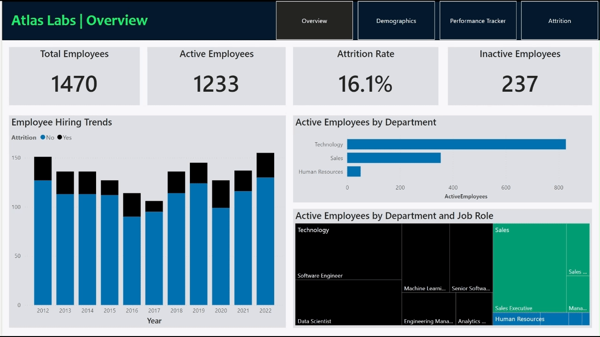

  _Demographics_ page includes key statistics such as:
- Age Distribution: Ranges from 18 to 51 years old, with the majority being 20-29 years old (874 employees).
- Marital Status: The largest group is single (624 employees, 42.45% of the total).
- Gender Distribution: The majority are females between 30 and 39 years old.
- Ethnicity: The highest number of employees are white, with an average salary around $110K.
  
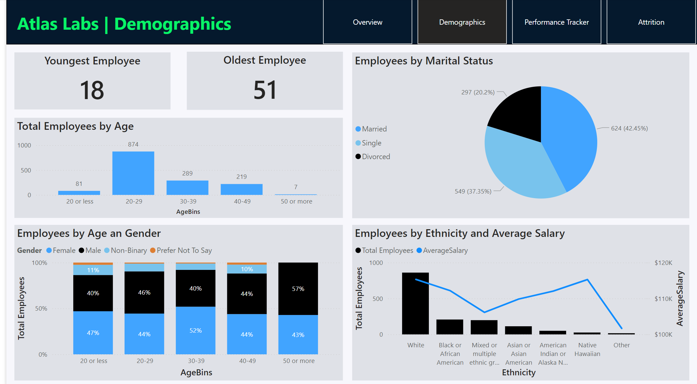

The interactive features of the Demographics dashboard enable users to delve into various demographic metrics and gain detailed insights into employee data.

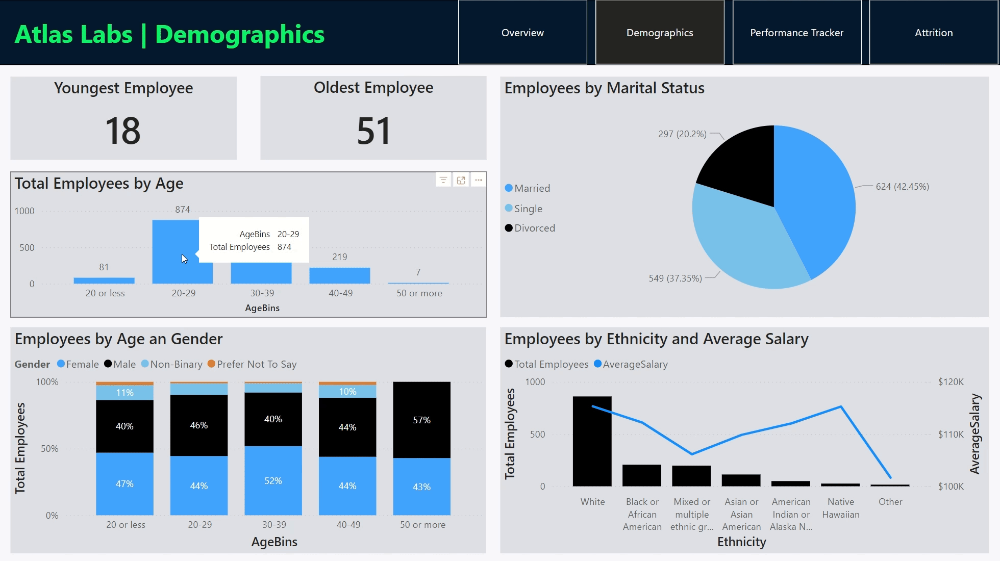

  _Performance Tracker_ is a page designed to visualise individual employee performance scores based on yearly performance reviews. The dashboard includes various elements such as:
- KPIs: Key Performance Indicators of individual scores on different criteria such as job satisfaction, environment satisfaction, relationships satisfaction, and work-life balance across multiple years.
- Review Records: Individual records of the start date (when the employee started working at the company), the date of the last review, and the due date for the next review.
- Comparison Charts: Visual comparisons of self-performance metrics and those by their management.

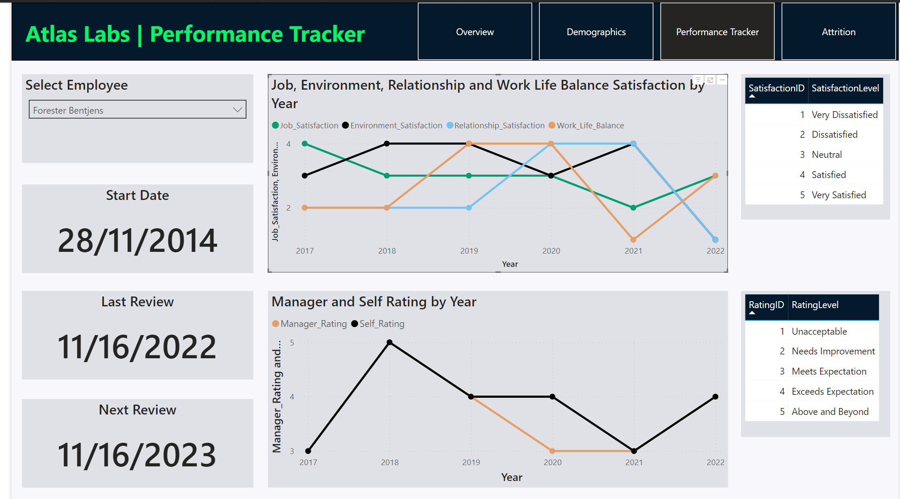

Users can select an individual employee to view their specific performance scores and review records in detail.

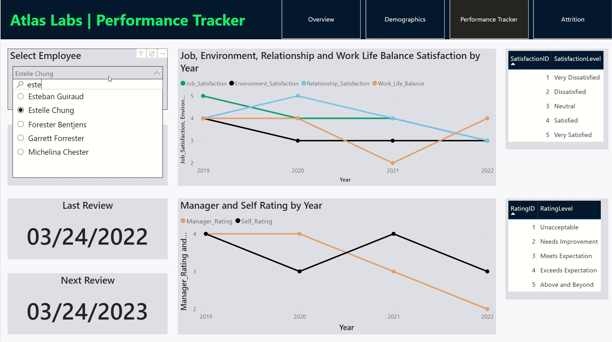

  _Attrition_ is a page that displays in-depth plots related to the company's attrition rate. The dashboard includes various elements such as:
- Overall Attrition Rate: The overall percentage of employees leaving the company (16.1%).
- Department and Job Role: Attrition rates segmented by different departments and job roles. The highest is Sales Representatives with 39.8%.
- Travel Frequency: Attrition rates based on employees' travel frequency. The highest are frequent travellers with 24.9%.
- Overtime Requirement: Attrition rates correlated with overtime work requirements. The highest (30.5%) for those with overtime requirements.
- Attrition by Hire Date: Analysis of attrition rates by employee hire dates. 2020 was the year with the highest rate (22.0%).
- Tenure: Breakdown of attrition rates based on employees' length of tenure at the company. The majority are employees with less than two years of tenure.

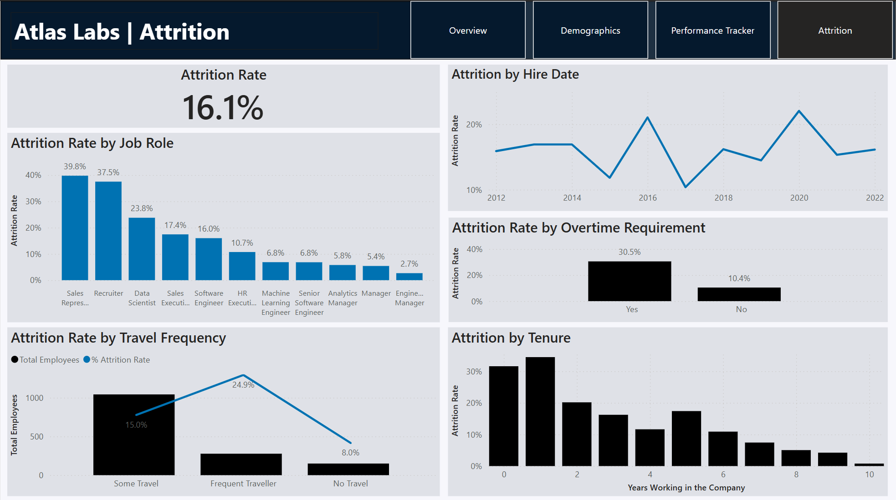

Users can interact with the dashboard to explore these metrics and gain detailed insights into employee turnover.

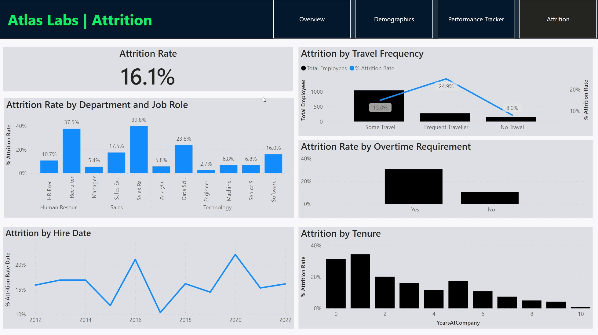

---

## Results and Implications
### Demographics
- The workforce is relatively young, with a majority of employees aged 20-29.
- While there is a gender imbalance, the company has a diverse workforce in terms of ethnicity.
- Employees who identify as white have the highest average salary, whereas mixed or multiple ethnic groups have one of the lowest average salaries

### Attrition:
- The overall attrition rate of 16.1% is higher than industry benchmarks ([Onsight Global](https://insightglobal.com/blog/employee-attrition-rate-how-to-calculate-improve/)).
- Sales and Sales Representative roles have significantly higher turnover rates, indicating potential issues with job satisfaction, work-life balance, or management.
- Frequent travelers and overtime workers are most likely to resign, as they have the highest attrition rate.

### Performance:
- A discrepancy between managerial ratings and self-performance ratings suggests potential misalignment in expectations or performance evaluation processes.

### Implications:
- High turnover rates can lead to increased costs, decreased productivity, and a negative impact on company culture.
- Addressing the root causes of attrition is essential for improving retention and creating a positive work environment.

---

## PowerBi File
If you want to review the detailed analysis, you can download the Power BI file from [here](assets/report/Report-HR-analytics-in-PowerBI.pbix)

